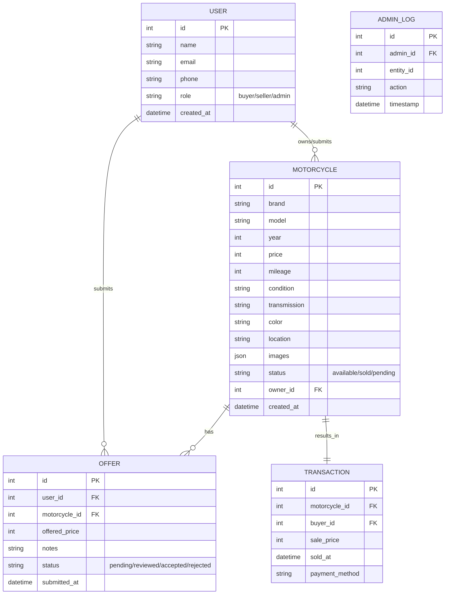
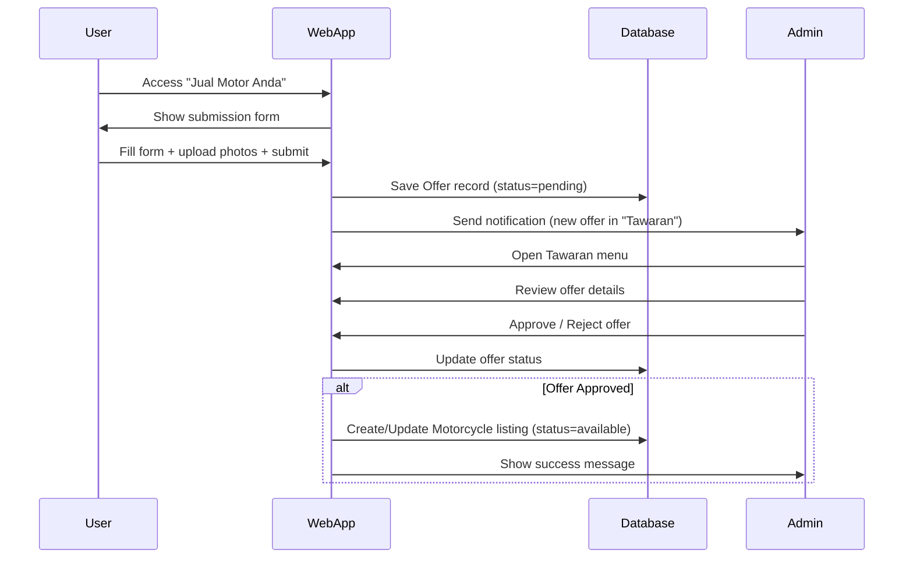

```markdown
## Overview & problem statement

Bagong Jaya Motor is a web application for a single used motorcycle dealer in Indonesia. The platform provides a beautiful, modern catalog experience for browsing used motorcycles and enables regular users to submit offers of their own motorcycles directly to the dealer. 

The main problem is the fragmented and low-quality experience in Indonesia’s used motorcycle market. Buyers struggle to find trustworthy, well-presented inventory with good photos and filtering. Dealers face difficulty in consistently acquiring quality inventory. Current processes (WhatsApp, manual forms) lack structure, tracking, and reporting capabilities.

The web app solves these by delivering a premium catalog experience and a streamlined “Jual Motor Anda” submission flow that feeds directly into an admin “Tawaran” (Offers) management system, along with sales history and Excel export functionality.

## Goals and non-goals

**Goals:**
- Deliver a visually appealing, modern catalog with large photos, rich filtering, and attractive card/masonry layout
- Enable users to easily submit motorcycle offers to the dealer
- Provide admin/owner with clear visibility into offers, inventory, and monthly sales performance with Excel export
- Increase lead generation and inventory acquisition for Bagong Jaya Motor
- Improve overall user experience for Indonesian buyers and sellers

**Non-goals:**
- Becoming a multi-dealer marketplace
- Implementing online payments or escrow
- Building a native mobile app (web responsive only)
- Advanced AI valuation or 360° views in v1
- Supporting individual peer-to-peer sales

## Target users

- **Buyers**: Indonesian general public (primarily ages 20-40) looking to purchase used motorcycles
- **Sellers**: Individuals who want to offer their used motorcycles to Bagong Jaya Motor
- **Admin/Owner**: Staff and owner of Bagong Jaya Motor who manage listings, review offers, and monitor sales performance

## Core features & functional requirements

**Catalog Experience**
- Modern design with large hero images and prominent photography
- Toggle between Grid and Masonry layout
- Attractive card design with hover effects showing key info (price, year, mileage)
- Comprehensive filters: brand, model, year, price range, mileage, transmission, color, condition, location
- Photo zoom and multi-image gallery on detail page
- Sorting options (newest, price low-high, price high-low)

**User Features**
- User registration and login
- “Jual Motor Anda” form allowing users to upload motorcycle details, multiple photos, asking price, and description
- Wishlist/favorites
- Inquiry button with WhatsApp integration
- Motorcycle detail page with full specifications and condition report

**Admin Features**
- Admin dashboard with overview metrics (active listings, pending offers, monthly sales)
- Catalog management (create, edit, publish, archive motorcycles)
- Dedicated **“Tawaran” (Offers)** menu to review, approve, reject, or negotiate user submissions
- Sales history and transaction log with monthly filtering
- Excel export functionality for sales reports (motorcycles sold, revenue, per-month summary)
- User and offer management

**Functional Requirements**
- All catalog pages must be mobile responsive
- Submitted offers must appear instantly in Admin → Tawaran with notification
- Admin must be able to change offer status (Pending, Reviewed, Accepted, Rejected)
- System must store multiple photos per motorcycle
- Excel export must include date, motorcycle details, sale price, and buyer info

## User flow (narrative step-by-step)

1. A visitor lands on the homepage and sees a modern hero banner and featured motorcycles.
2. They navigate to the Catalog page, apply filters (price, year, brand), and browse using either Grid or Masonry layout.
3. User clicks a card to view the detail page, zooms photos, reads specifications, and can add to wishlist or click “Hubungi” (WhatsApp).
4. A user who wants to sell their motorcycle clicks “Jual Motor Anda”, registers/logs in, fills the form with photos and details, and submits the offer.
5. The submitted offer is saved and immediately visible in the Admin “Tawaran” menu.
6. Admin reviews the offer, approves or rejects it, adds internal notes, and if approved, converts it into an active listing.
7. When a motorcycle is sold, admin marks it as sold, records the transaction, and it appears in the monthly sales history.
8. Admin filters sales by month and exports the report to Excel for business analysis.

## Data model



## Key sequences



## Open questions / risks

- How will photo quality and accuracy of user-submitted data be verified?
- What is the expected volume of offers and how will admin handle high volume?
- Should there be a moderation queue or automatic rejection rules?
- Legal aspects of transferring ownership and required documentation in Indonesia
- SEO and performance on slow mobile networks common in Indonesia
- Competition from large marketplaces (OLX, Mobil123, etc.)

## Suggested roadmap (phases)

**Phase 1 – MVP (6-8 weeks)**
- Beautiful catalog with filters and modern UI
- User registration and “Jual Motor Anda” submission
- Admin panel with Tawaran menu and basic catalog management
- Basic sales logging

**Phase 2 – Reporting & Polish (4-6 weeks)**
- Full sales history and Excel export functionality
- Dashboard analytics
- Wishlist, improved photo gallery, WhatsApp deep linking
- SEO optimization and performance tuning

**Phase 3 – Growth Features (8+ weeks)**
- Advanced search and recommendation
- Admin content management for promotions
- User testimonials and blog section
- Basic analytics dashboard with charts
- Potential integration with external vehicle history services
```

**End of PRD**